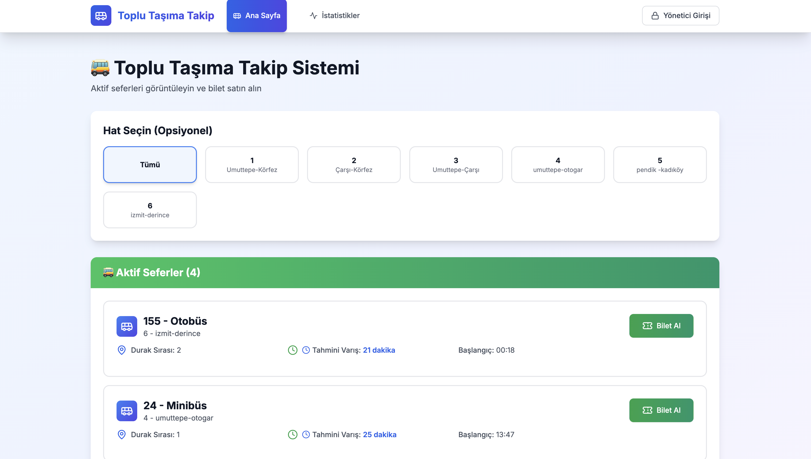
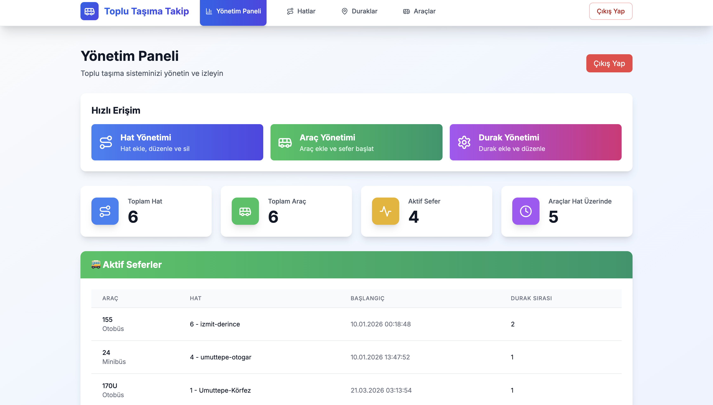
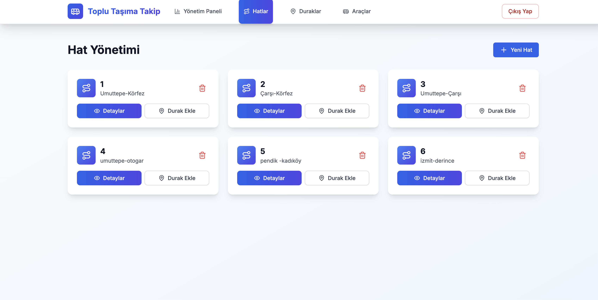
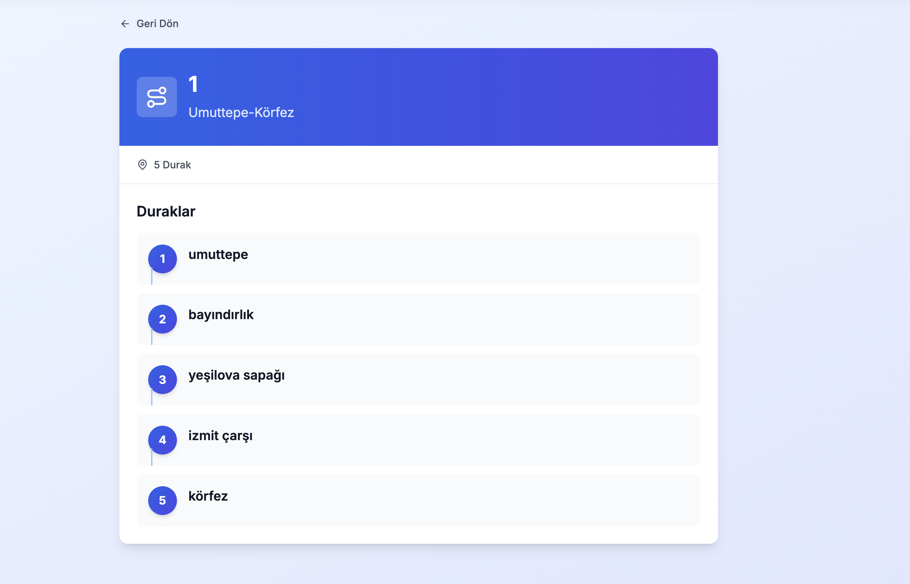
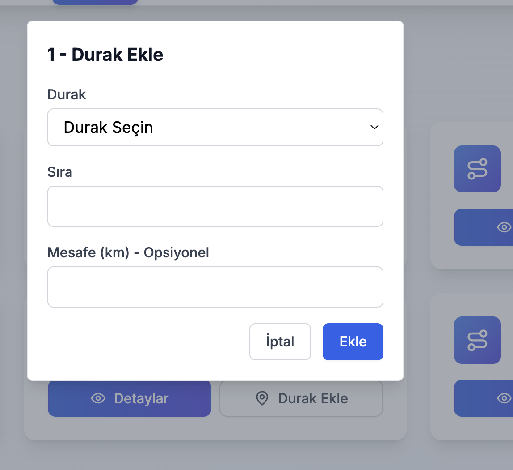
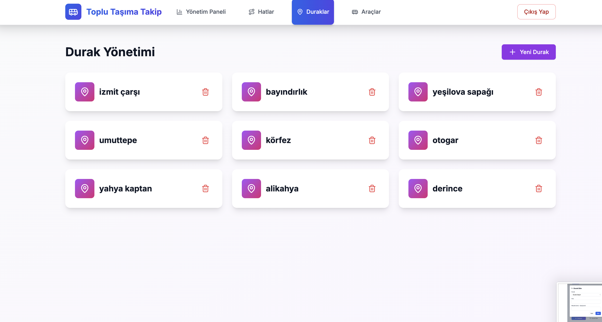
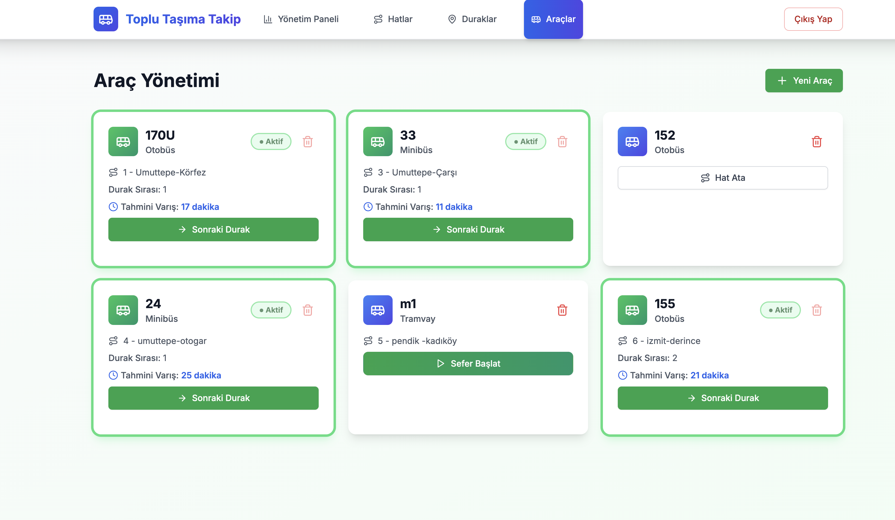

# 🚌 Transport Tracking System

A full-stack transport tracking system developed to manage routes, stops, vehicles, trips, ticket operations, and ETA (estimated arrival time) calculations through a modern web interface.

---

## 📌 About the Project

This project was developed as a full-stack web application for public transportation management and passenger information. The system enables users to view active trips, follow estimated arrival times, and interact with transport data through a responsive user interface. It also provides an admin panel for managing routes, stops, vehicles, and trips.

The backend is built with Spring Boot and PostgreSQL, while the frontend is developed with Next.js and TypeScript. Communication between the frontend and backend is handled through RESTful APIs using JSON.

---

## ⚙️ Tech Stack

### Frontend
- **Next.js**
- **React**
- **TypeScript**
- **Tailwind CSS**
- **TanStack Query**
- **Axios**
- **Recharts**
- **Lucide React**

### Backend
- **Java 17**
- **Spring Boot**
- **Spring Web**
- **Spring Data JPA**
- **SpringDoc OpenAPI**

### Database
- **PostgreSQL**

### Communication
- **RESTful API**
- **JSON**
- **HTTP / HTTPS**

---

## ✨ Features

- 🛣️ **Route Management**
- 📍 **Stop Management**
- 🚌 **Vehicle Management**
- ⏱️ **ETA Calculation:** Estimated arrival time per stop
- 🚏 **Active Trip Tracking**
- 🎫 **Ticket Operations**
- 📊 **Usage Statistics**
- 🔐 **Admin Login and Authorization**
- 📱 **Fully Responsive UI**
- 📄 **Swagger / OpenAPI Documentation**

---

## 📂 Project Structure
```text
transport-tracking-system/
├── frontend/
│   ├── app/
│   ├── components/
│   ├── contexts/
│   ├── lib/
│   └── types/
│
├── backend/
│   ├── src/main/java/
│   │   ├── entity/
│   │   ├── repository/
│   │   ├── service/
│   │   └── controller/
│   └── resources/
│
└── README.md
```

---

## 🚀 Getting Started

### 1. Clone the repository
```bash
git clone https://github.com/derya003/transport-tracking-system.git
cd transport-tracking-system
```

### 2. Backend Setup
```bash
cd backend
```

Run with Maven Wrapper:
```bash
./mvnw spring-boot:run
```

Or with global Maven:
```bash
mvn spring-boot:run
```

Configure your database in `application.properties`:
```properties
spring.datasource.url=jdbc:postgresql://localhost:5432/transport_db
spring.datasource.username=your_username
spring.datasource.password=your_password
spring.jpa.hibernate.ddl-auto=update
spring.jpa.show-sql=true
```

### 3. Frontend Setup
```bash
cd ../frontend
npm install
npm run dev
```

---

## 🔗 API Documentation

Swagger UI is available after starting the backend:
```
http://localhost:8080/swagger-ui/index.html
```

---

## 📊 Core Modules

| Module | Description |
|--------|-------------|
| **Routes** | Stores route code and route information |
| **Stops** | Stores stop data and location information |
| **Trips** | Stores trip time and status data |
| **Vehicles** | Stores vehicle identity, capacity, and activity status |
| **Tickets** | Stores ticket operations and usage information |

---

## 🧠 System Architecture

The project follows a layered full-stack architecture where frontend, business logic, and database access are separated. The frontend communicates with the backend via RESTful APIs, and the backend handles business rules, validation, ETA calculation, and database operations.

---

## 📸 Screenshots

### 🏠 Home Page
> Active trips listed with route selection, ETA, and ticket purchase options.



### 📊 Admin Dashboard
> Quick access to route, vehicle, and stop management. Displays total routes, vehicles, active trips, and vehicles on route.



### 🛣️ Route Management
> View, add, and delete routes. Navigate to route details or add stops directly.



### 🗺️ Route Stops Detail
> View the ordered list of stops for a selected route (e.g. Umuttepe–Körfez with 5 stops).



### ➕ Add Stop to Route (Modal)
> Select a stop, set the order, and optionally enter the distance in km.



### 📍 Stop Management
> View and delete all stops in the system in a responsive card grid layout.



### 🚌 Vehicle Management
> Manage vehicles with active trip info, ETA display, and next stop progression.



---

## 📌 Future Improvements

- [ ] Real-time vehicle position updates
- [ ] More advanced analytics dashboards
- [ ] Enhanced ETA prediction logic
- [ ] Role-based admin permissions
- [ ] Live deployment for public access

---

## 👩‍💻 Authors

- **Derya Durgun**

---

## ⭐ Show Your Support

If you like this project, give it a ⭐ on GitHub!